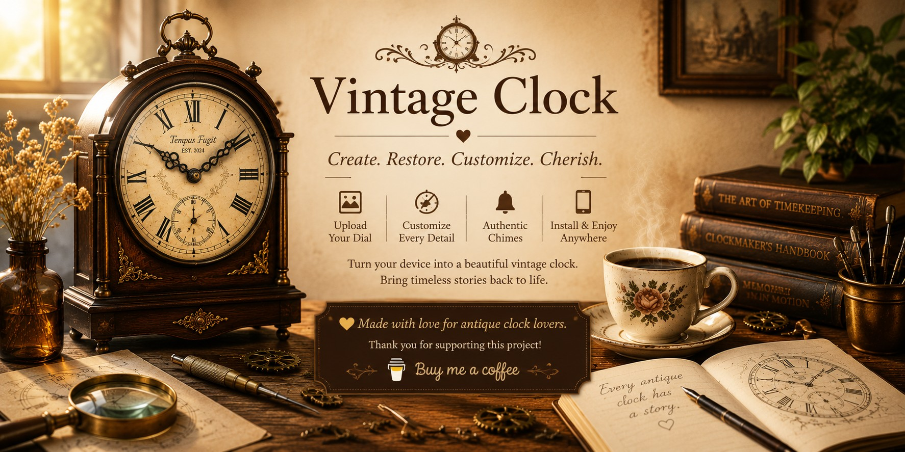

  

# Vintage Clock

Bring timeless clocks back to life.
Vintage Clock lets you create a beautiful vintage clock using your own antique dial images, elegant hands, classic numerals, and authentic clock chimes.

Turn an old tablet, phone, or computer into a full-screen vintage clock that feels right at home.

🌐 **Website**

https://vintageclock.net

---

## Privacy First

- No account required
- No password
- No tracking
- Your clocks stay on your own device
- Images and sounds are never uploaded to our server

## Features

✔ Upload your own antique clock dial

✔ Built-in vintage clock faces

✔ Roman or Arabic numerals

✔ Adjustable numeral size, color and position

✔ Multiple hand styles

✔ Westminster chimes

✔ Custom chime upload

✔ Full-screen clock display

✔ Install as an app (PWA)

✔ Works offline after installation

✔ Supports:

- iPhone & iPad
- Android
- Windows
- macOS

---

## Perfect for

- Antique clock collectors
- Grandfather clocks
- Mantel clocks
- Railway clocks
- Pocket watch lovers
- Clock restoration projects
- Vintage home décor
- Turning an old tablet into a beautiful wall clock

---

## Why Vintage Clock?

Most clock apps simply display the current time.

Vintage Clock was created to preserve the beauty and character of antique clocks.

Whether you're restoring a family heirloom, recreating an old clock dial, or designing your own unique timepiece, Vintage Clock helps bring timeless stories back to life.

---

## Install as an App

### iPhone / iPad

Open Vintage Clock in Safari.

Tap **Share** → **Add to Home Screen**.

Launch it from your Home Screen for an app-like experience.

### Android

Open the website in Chrome.

Tap **Install App** (or **Add to Home Screen**) when prompted.

Vintage Clock works beautifully offline after installation.

---

## Live Demo

https://vintageclock.net

## Acknowledgements

Some built-in clock chime sounds are royalty-free audio provided by **OtoLogic**.

https://otologic.jp/

These audio files are provided under the OtoLogic license and are **not covered by the MIT License**.

Thank you to OtoLogic for providing high-quality sound resources.

---

## Support the Project

Vintage Clock is completely free.

If it has brought a little warmth to your home, please consider supporting future development.

☕ Buy Me a Coffee

https://buymeacoffee.com/vintageclock

Every contribution helps keep Vintage Clock ticking.

❤️ Thank you for supporting independent development.

---

## License

MIT License

---

## Made with ❤️ for antique clock lovers.

Every antique clock has a story.

Thank you for helping keep those stories alive.
